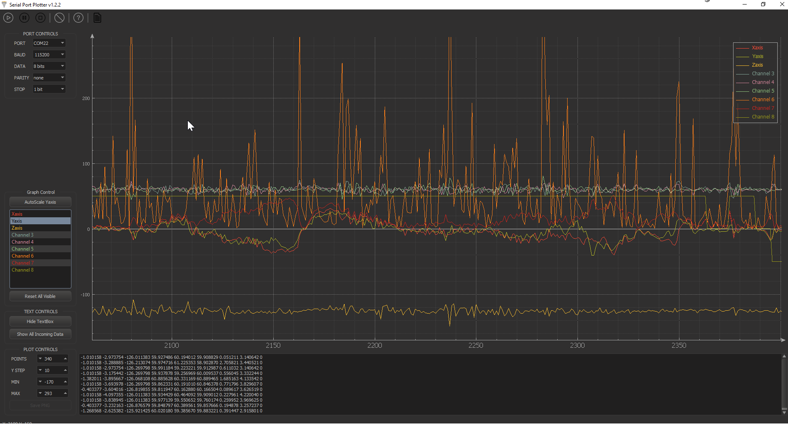

# MPCC — Multi-Photon Coincidence Counter (CIOp)

Software de instrumentación científica para el **detector de fotones en coincidencias múltiples** desarrollado en el Centro de Investigaciones Ópticas (CIOp — CONICET / CIC-PBA / UNLP).

El detector está implementado sobre una placa **FPGA DE0 Nano SoC** (Altera/Intel) programada en VHDL, que se comunica con la PC por **UART/RS232**, con 12 canales: 4 de conteo individual y el resto para coincidencias configurables de hasta 4 canales en simultáneo.

Desarrollada en **C++ con el framework Qt**, la aplicación configura el experimento, transmite los parámetros al FPGA, grafica los conteos en tiempo real y registra la adquisición en disco para su procesamiento estadístico posterior.

**Versión actual:** 2.3.0

## Captura de pantalla




---

## Contexto

El proyecto se enmarca en *"Diseño y desarrollo de dispositivos ópticos para comunicaciones cuánticas aeroespaciales"* (PICT-2020-SERIE A-I-GRF), orientado a distribución cuántica de claves (QKD) como carga útil del **Satélite Universitario** de la UNLP, bajo el estándar CubeSat.

El desarrollo se realizó en el marco de una **Práctica Profesional Supervisada** de la carrera de Ingeniería Industrial (Facultad de Ingeniería, UNLP), bajo la dirección del Dr. Ing. Fabián Alfredo Videla, con la co-dirección de la Dra. Lorena Rebón.

---

## Funcionalidad

- Configuración de canales de conteo y combinaciones de coincidencia mediante una matriz de 32 posiciones (4 filas A–D × 8 columnas).
- Ajuste de ancho de pulso y retardos independientes para los cuatro canales de entrada.
- Definición de la ventana temporal de integración y de la duración total del experimento.
- Visualización en tiempo real de conteos individuales y en coincidencia (QCustomPlot).
- Grabación en CSV con metadatos de experimento, más un HTML paralelo con formato.
- Perfiles de experimento persistidos en JSON.
- Supervisión de la salud de la comunicación y control previo a la ejecución.

### Hardware comandado

| Parámetro | Valor |
|---|---|
| Canales | 12 (4 de conteo individual, el resto para coincidencias de hasta 4 canales) |
| Matriz de configuración | 32 posiciones (4 × 8) |
| Ventana de integración | 5,6 ms – 99.999.999 unidades base, normalizada a múltiplos de 8 por el FPGA |
| Ancho de pulso y retardos A–D | 0 – 255, sin normalización |
| Enlace | UART/RS232, 115200 8N1 (típico) |

---

## Documentación

| Documento | Contenido |
|---|---|
| [`MANUAL_USUARIO.md`](MANUAL_USUARIO.md) | Manual completo para operadores del instrumento: puesta en marcha, operación y referencia |

El manual se distribuye junto al ejecutable y es accesible desde la propia aplicación en *Ayuda → Manual de Usuario*. Este README cubre únicamente la construcción y la estructura del código.

---

## Arquitectura

La base de código original consistía en una clase `MainWindow` monolítica que concentraba comunicación, parseo, protocolo, visualización y persistencia sin separación de responsabilidades. La reestructuración extrajo esas responsabilidades transversales a módulos independientes:

| Módulo | Responsabilidad |
|---|---|
| `SerialPortManager` | Comunicación serie: apertura, cierre, lectura asíncrona y escritura no bloqueante |
| `SerialMessageParser` | Parseo por máquina de estados del protocolo `$…;`: descarta en silencio los caracteres no válidos dentro de una trama, carácter a carácter. No evalúa ni descarta tramas completas — esa clasificación válida/inválida para la telemetría de salud ocurre en `MainWindow` |
| `FpgaProtocol` | Construcción de paquetes, conversión y normalización de tiempos, etiquetas y mapeo de trama |
| `PlotManager` | Visualización en tiempo real sobre QCustomPlot |
| `CsvManager` | Exportación a CSV con metadatos, más un archivo HTML de formato paralelo |
| `ProfileManager` | Persistencia de perfiles de experimento en formato JSON |

`MainWindow` quedó como **coordinador**: instancia los módulos, los conecta mediante señales y slots (recepción cruda → parseo → nueva data → ploteo → guardado), y gobierna la máquina de estados de la aplicación.

**Flujo de datos:**

```
FPGA → SerialPortManager → SerialMessageParser → MainWindow → PlotManager / CsvManager
```

### Máquina de estados

`MainWindow` gobierna la disponibilidad de los controles mediante un estado operativo explícito (`enum class AppState`, definido en `mainwindow.hpp`):

```
Disconnected → ReadyForConfiguration → Acquiring ⇄ Paused
                                             ↓
                                           Fault
```

Las transiciones se validan formalmente en `canTransitionToState()`, invocada desde `setAppState()`: cualquier cambio de estado no contemplado en el flujo operativo es rechazado y registrado. El estado `Fault` se alcanza cuando el control previo detecta una condición inválida o cuando la proporción de tramas inválidas supera el 25 % sostenido; se sale de él desconectando. `updateUIForState()` y `getStateDisplayName()` completan el gobierno del estado sobre la UI.

### Robustez operativa

- **Control previo a la ejecución** (`performPreflightCheck()`, con la estructura `PreflightResult`): verifica puerto conectado, al menos un canal activo, valor de tiempo mayor que cero, ventana de integración dentro de rango y archivo CSV abierto cuando la grabación está habilitada. Si falla, no se transmite la configuración.
- **Telemetría de salud** (`HealthMetrics`): conteo de paquetes válidos, inválidos y perdidos, con advertencia a partir del 10 % de tramas inválidas sostenido y paso a estado `Fault` al 25 %.
- **Registro de eventos** (`EventType`, `OperativeEvent`) con marca temporal y categorización por tipo (`PortOpened`, `PortClosed`, `Started`, `Stopped`, `ConfigApplied`, `Reset`, `Recovery`, `Error`), exportable con `exportEventLog()`.
- **Recuperación ante fallos** (`ConnectionParams`): almacenamiento de los parámetros de la última conexión exitosa para reconexión automática.

---

## Compilación

### Requisitos

| Componente | Versión |
|---|---|
| Qt | 5.12.2 (módulos `serialport`, `printsupport`) |
| Compilador | MinGW 7.3.0 32-bit |
| Sistema | Windows |

> La ruta del proyecto no debe contener espacios: rompe a `mingw32-make`.

### Pasos

Desde la consola *Qt 5.12.2 (MinGW 7.3.0 32-bit)*, que trae el `PATH` ya configurado:

```cmd
cd /d <ruta-del-proyecto>
mkdir build-release
cd build-release
qmake ..\SerialPortPlotter.pro "CONFIG+=release"
mingw32-make -j4
```

El ejecutable resultante es `build-release\release\serial_port_plotter.exe`.

> El nombre del ejecutable (`serial_port_plotter.exe`) no coincide con el del archivo de proyecto (`SerialPortPlotter.pro`).

Para recompilar tras cambios en el código alcanza con `mingw32-make -j4`. Sólo hay que volver a ejecutar `qmake` si se modifica el `.pro` o se agregan archivos nuevos.

### Empaquetado

Carpeta portable con las dependencias de Qt y del runtime de MinGW (comandos ejecutados desde `build-release`):

```cmd
mkdir C:\deploy
copy release\serial_port_plotter.exe C:\deploy
windeployqt --release C:\deploy\serial_port_plotter.exe
copy C:\Qt\Qt5.12.2\Tools\mingw730_32\bin\libgcc_s_dw2-1.dll C:\deploy
copy C:\Qt\Qt5.12.2\Tools\mingw730_32\bin\libstdc++-6.dll C:\deploy
copy C:\Qt\Qt5.12.2\Tools\mingw730_32\bin\libwinpthread-1.dll C:\deploy
copy ..\MANUAL_USUARIO.md C:\deploy
```

Conviene verificar el paquete ejecutándolo desde una consola limpia, sin el `PATH` de Qt cargado.

`MANUAL_USUARIO.md` debe acompañar al ejecutable: el menú *Ayuda → Manual de Usuario* lo lee del disco en tiempo de ejecución y no está embebido como recurso Qt.

### Instalador

El instalador de Windows se genera con Inno Setup a partir de `installer.iss`, que copia el manual y las licencias al directorio de instalación junto al `.exe`.

---

## Banco de pruebas virtual

El repositorio incluye `inyector3.py`, un simulador de tramas de FPGA escrito en Python con `pyserial`. Combinado con un par de puertos COM virtuales (com0com), permite verificar la aplicación sin depender del hardware:

```
inyector3.py → puerto virtual A ↔ puerto virtual B → serial_port_plotter.exe
```

El inyector genera tramas con el formato del protocolo a 20 Hz, modelando cada canal físico como una onda cuadrada con frecuencia, ciclo de trabajo y fase configurables. Las columnas de coincidencia cuentan las muestras internas en que todos los canales de esa combinación estuvieron simultáneamente en nivel alto, de modo que el resultado esperado es predecible analíticamente antes de correr la prueba.

**Valida:** el parseo de tramas, el mapeo de columnas, el conteo de coincidencias contra valores calculados de antemano y las métricas de salud bajo carga sostenida.

**No valida:** temporización real de la FPGA, ruido eléctrico ni comportamiento del adaptador USB-serie físico. Eso sigue requiriendo el banco con osciloscopio y generador de señales.

La configuración se ajusta editando la sección `CONFIG` del script. `inyector_corrupto.py` es una variante que además inyecta tramas corruptas (campos faltantes, texto no numérico, delimitadores rotos, basura binaria, tramas truncadas) para probar la robustez del parser y la telemetría de salud frente a datos malformados.

---

## Protocolo y formato de datos

### Trama serie

La aplicación espera tramas que comienzan con `$`, terminan con `;` y llevan los valores separados por espacios:

```
$valor1 valor2 … ;
```

Ejemplo de emisión desde el dispositivo:

```c
printf("$%d %d;", dato1, dato2);
```

Se admiten enteros y decimales, positivos y negativos. El parser descarta en silencio los caracteres no válidos dentro de una trama, carácter a carácter. Las tramas con campos vacíos o no numéricos se contabilizan como inválidas en la telemetría de salud, pero no se descartan: los campos numéricos que sobreviven igual llegan al gráfico y al CSV, por lo que ante advertencias de tramas inválidas conviene revisar los datos registrados.

### Salida CSV

Cada archivo lleva un encabezado con los metadatos del experimento, incluida la versión de la aplicación. La primera columna es el **tiempo en segundos**. Junto al CSV se genera automáticamente un archivo `<nombre>_formato.html` con los mismos datos formateados, para inspección visual rápida.

Cuando la duración de experimento configurada es mayor que cero, la grabación es obligatoria: la aplicación no inicia la adquisición sin un CSV abierto.

El mapeo de columnas del CSV se fija al abrir el archivo (`CsvManager::openCsvFile()`) y no se actualiza mientras esté abierto. `Pausa/Reanuda` solo pausa y reanuda la adquisición y el guardado en curso, sin habilitar ninguna reconfiguración: `updateUIForState()` bloquea todo el panel (matriz, selectores, tiempo, ancho de pulso, retardos, "Enviar Datos" y "Reset") durante toda la pausa, haya o no grabación activa, así que nunca se reenvía una configuración con un mapeo de columnas distinto al que ya quedó escrito en el CSV abierto.

### Perfiles

Archivos JSON en la carpeta de datos de la aplicación. Cada perfil guarda la matriz de canales activos, el ancho de pulso, los cuatro retardos, el valor y la unidad de tiempo, y la fecha de creación.

API estática de `ProfileManager`: `profilesDirectory()`, `profileNames()`, `profilePath()`, `saveProfile()`, `loadProfile()`, `deleteProfile()`, `renameProfile()`, `applyProfileToUi()`. La estructura `OperativeProfile` implementa `toJson()` / `fromJson()`.

---

## Flujo de trabajo

1. Conectar la placa FPGA y verificar el puerto COM asignado.
2. *Puerto Serial → Propiedades de Puerto…* para fijar puerto, baudios, bits de datos, paridad y bits de parada.
3. *Puerto Serial → Conectar*. La aplicación pasa a **Listo para configurar** y reinicia la matriz de canales.
4. Configurar la matriz, la columna a graficar y los parámetros temporales.
5. **Enviar Datos**: ejecuta el control previo, abre el CSV si corresponde, transmite la configuración al FPGA e inicia la adquisición.
6. *Pausa/Reanuda* pausa o reanuda exclusivamente la adquisición y el guardado en curso, sin cerrar el puerto; no habilita ninguna reconfiguración. La matriz, los selectores, los parámetros temporales, *Enviar Datos* y *Reset* quedan bloqueados durante toda la pausa, haya o no grabación activa.
7. *Desconectar* cierra el puerto, detiene el cronómetro y cierra el archivo CSV.

### Atajos

| Atajo | Acción |
|---|---|
| `F1` | Ayuda incorporada |
| `Ctrl+S` | Activar / desactivar grabación en CSV |
| `Ctrl+Tab` | Alternar con el panel de configuración alternativo |
| `Ctrl+Q` | Salir |
| Reproducir / Pausa / Detener | Conectar, Pausa/Reanuda y Desconectar (teclas multimedia) |

---

## Estructura del repositorio

```
SerialPortPlotter.pro         Archivo de proyecto qmake
main.cpp                      Punto de entrada
mainwindow.{hpp,cpp,ui}       Ventana principal y máquina de estados
helpwindow.{hpp,cpp,ui}       Ventana de ayuda / manual embebido
serialportmanager.{hpp,cpp}   Comunicación serie
serialmessageparser.{hpp,cpp} Parseo del protocolo $…;
fpgaprotocol.{hpp,cpp}        Construcción de paquetes y conversiones
plotmanager.{hpp,cpp}         Visualización en tiempo real
csvmanager.{hpp,cpp}          Exportación CSV + HTML
profilemanager.{hpp,cpp}      Perfiles JSON
qcustomplot/                  Biblioteca de graficado (third-party)
installer.iss                 Script de Inno Setup
inyector3.py                  Simulador de tramas para banco de pruebas virtual
inyector_corrupto.py          Variante del inyector con tramas corruptas
MANUAL_USUARIO.md             Manual de usuario distribuido con el ejecutable
```

---

## Créditos

Desarrollado en el **Centro de Investigaciones Ópticas (CIOp)** — CONICET / CIC-PBA / UNLP.

- **Desarrollo:** Santiago Agustín Salgado — Ingeniería Industrial, Facultad de Ingeniería, UNLP.
- **Dirección:** Dr. Ing. Fabián Alfredo Videla.
- **Codirección:** Dra. Lorena Rebón.

Trabajo realizado en el marco de la Práctica Profesional Supervisada (480 h, ago 2025 – ago 2026).

Este software deriva del proyecto **Serial Port Plotter** de código abierto. Se reconoce el trabajo de sus autores originales:

- Trabajo original: [Borislav Kereziev](https://developer.mbed.org/users/borislav/) — [Serial Port Plotter en los foros de mbed](https://developer.mbed.org/users/borislav/notebook/serial-port-plotter/)
- Base del software: [CieNTi](https://github.com/CieNTi/serial_port_plotter)
- Exportación a CSV: [HackInventOrg](https://github.com/HackInventOrg)
- Biblioteca de graficado: [QCustomPlot](https://www.qcustomplot.com/)
- Iconos: *Line Icon Set* por [Situ Herrera](http://www.flaticon.com/authors/situ-herrera) y *Lynny icon pack*

Las adaptaciones para el detector de coincidencias múltiples, la reestructuración modular y las funcionalidades de robustez operativa fueron desarrolladas en el CIOp.

---

## Historial de versiones anterior al CIOp

Antes de la adaptación al detector de coincidencias múltiples, el proyecto base (*Serial Port Plotter*) siguió este historial, documentado según [Semantic Versioning](http://semver.org/):

### [1.3.0] - 2018-08-01

- Compilado con Qt 5.11.1; librerías Qt actualizadas y nuevas funciones de ploteo.
- Añadido: botón para refrescar la lista de puertos COM, control de visibilidad de canales, AutoScale del eje Y (+10 %), soporte para guardar en CSV.
- Cambiado: `qDarkStyle` a 2.5.4, `QCustomPlot` a 2.0.1.
- Corregido: foco del diálogo de renombrado de ejes al abrirse.

### [1.2.2] - 2018-07-26

- Proyecto derivado de HackInvent desde 1.2.1.
- Añadido: cuadro de texto UART para debug, con control de visibilidad y filtrado.

### [1.2.1] - 2017-09-24

- Corregido: soporte para float/double, y fallo de compilación en Linux relacionado con `serial_port_plotter_res.o`.

### [1.2.0] - 2016-08-28

- Añadido: soporte para números negativos y para tasas de baudios altas (probado hasta 912600 bps).

### [1.1.0] - 2016-08-28

- Añadido: recursos `qdarkstyle`, manifest de Windows, iconos *Line Icon Set* y *Lynny*, script de empaquetado con Inno Setup, botones de Play/Pause/Stop/Clear/Help.
- Cambiado: estructura de recursos, `QCustomPlot` a v1.3.2, menú principal reemplazado por barra de iconos.
- Eliminado: control sobre número de puntos, borrado de datos previos, botones separados *Connect* y *Start/Stop plot*.

### [1.0.0] - 2014-08-31

- Trabajo original de Borislav Kereziev.

---

## Licencia

Distribuido bajo la **GNU General Public License v3.0**. Ver [`LICENSE`](LICENSE) y [`GPL.txt`](GPL.txt). El proyecto incorpora **QCustomPlot** (GPL); las licencias correspondientes se distribuyen con el instalador.
